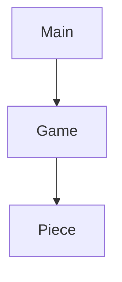

# Jogo Galo Da Velha

### Autoria

#### Elementos do grupo:
- Hugo Figueira Silva 22001815
- Steven Hall 2200173
  
### Report:

#### Hugo:
- Código:
  - _Game_ Construção do tabuleiro, mais tarde passado a classe _boardMapping_
    - _UI_ (Layout do tabuleiro, menu peças disponiveis, desenho das peças ,legenda, frases de output e cores)
    - Atualização do tabuleiro e movimento das peças
    - Condições de vitoria (Verificar linhas horizontais, verticais e diagonais)
    - Lógica de input e output (Como o jogador poderia escolher as peças e lugar do  tabuleiro desejado)
    - Mensagens de erro
    - Reescrever mensagem inicial (WelcomeText.txt)
  - _Bug fixing_
- Relatório

#### Steven: 
- Código: 
  - Classes  
     - _Piece_ 
     - _Game_ Instanciação de peças, organização, formatão e métodos: _RunGame, Welcome, CheckForDraw_ e _EndGame_.
    - _BoardMapping_ 
    - _FileDirectory_
   
  - Enumeradores
    - _GameStatus_ 
    - _Player_  
    - _PieceHole_
    - _PieceShape_
    - _PieceSize_
    - _PieceColor_ 
  - _Bug fixing_ 
- Relatório

## Arquitetura da solução
### Descrição da solução
- Projeto desenvolvido utilizando a linguagem _C#_ 8.0 e com  [_.NET_](https://learn.microsoft.com/en-us/dotnet/api/?view=netstandard-2.1).

- Projeto consiste no jogo do GaloDaVelha, mas apresentado visualmente em consola (terminal)

A solução do projeto consiste em jogar o jogo do GaloDaVelha na consola, isto é um jogo para 2 jogadores (PvP). Cada jogador tem o seu respetivo turno, dai cada jogador tem a possibilidade ganhar ou empatar (se não houver mais peças disponíveis).

Antes do jogo começar aparece um texto inicial, explicando as regras do jogo. Para avançar para o jogo, o utilizador precisa de carregar na tecla ENTER tal como referido.

De seguida aparece a primeira visualização do jogo, apresentado um tabuleiro, menu das peças disponiveis, legenda e o turno do jogador.

O tabuleiro no estado zero do jogo encontrasse vazio, estando apenas letras do abecedario a ocupar os espaços de cada dimensão. Essas letras representam o lugar de cada espaço disponivel no tabuleiro.

O menu das peças disponiveis representam tal como o referido, as peças disponiveis. Cada peça tem o seu tamanho, cor, forma e furo. A forma é representado por simbolos Unicode, tendo visualmente quadrados e circulos. Para representar aqueles que têm furo ou não, as formas que estão preenchidas não têm furo, aquelas que só têm um conturno a volta representam as formas com furo. A cor é presentado pela própria cor que cada peça tem, tendo peças verdes ou amarelas. O tamanho é representado pelas letras _B_ (grande) e _s_ (pequeno). Essas letras são sempre representadas como 2º caracter da forma. Cada peça tem o seu número dentro de um parentesses reto. Esse número serve como referencia ao jogador para poder escolher a peça desejada ao intrudizir o numero correspondente ao mesmo.

Caso a operação anterior realize-se com sucesso, será apresentado um menu de inventário com os itens presentes no ficheiro selecionado no passo anterior.

- Adicionar itens: Para adicionar itens a este inventário (clicar em _add_) e em seguida é apresentado outro menu com a lista de todos os itens disponíveis (clicar no item desejado). Assim será adicionado o item escolhido ao inventário.

- Remover itens: Para remover itens devemos passar o rato em cima do item desejado (clicar no item para a janela de descrição fixar-se) e clicar no ícone x. Assim será removido do inventário o item escolhido.

#

#### Princípios _SOLID_

- Princípios _SOLID_ utilizados nesse projeto foram: _**Single Responsability Principle**_.  
  - O inventário ou a classe inventário apenas tem a responsabilidade de cuidar do inventário em si.  
   - _ItemUI_ trata das funções presentes no _UI_ do item respectivo.  
   -  _FileIO_ apenas trata dos ficheiros.
   -  _ItemAdder_ adiciona itens.  
  
Portanto concluímos assim que as funções só fazem a uma função que lhes foi dada e não varias coisas diferentes.

### Diagrama _UML_

## Referências 

### IAs generativas
  O uso de IAs generativas foi usado e neste tópico explicaremos como: 
- O _Chat Bing_ (_Chat GPT-4_) foi utilizado para tirar dúvidas e explicar itens da [documentação](https://learn.microsoft.com/en-us/dotnet/api/?view=netstandard-2.1) de forma mais clara e simples, erros, exemplos e também para obter de forma mais rápida _links_ com código útil com foi o caso particular do tópico [Remover linhas do ficheiro](https://stacktuts.com/how-to-delete-a-line-from-a-text-file-in-c).   
  Sem mencionar que um é um erro comum quando o nome de ficheiro não é válido ao utilzarmos o [_stream reader_](https://learn.microsoft.com/en-us/dotnet/api/system.io.streamreader?view=netstandard-2.1) onde pelo menos podemos dizer que foi a nossa experiência ao utilizar esta classe do [_C#_](https://learn.microsoft.com/en-us/dotnet/csharp/).

  
- Nenhum código fornecido por IAs generativas foi diretamente utilizado para a realização desse projeto como explicado acima, apenas a título de curiosidade, pesquisa, exemplos e explicação de tópicos da documentação.

### Consultas com docentes
Relativamente a consulta feita com professores, um professor foi consultado para ajudar em algumas questões. Este foi o professor Diogo Andrade onde auxiliou em 2 questões sendo essas respectivamente:

- [_UnauthorizedAccessException_](https://learn.microsoft.com/en-us/dotnet/api/system.unauthorizedaccessexception?view=netstandard-2.1). Este erro foi apresentado ao docente para poder obter-se alguma explicação do porque poderia estar a acontecer tal erro. Para resolver o problema foi sugerido pelo professor Diogo rever o código, verificar valor das variáveis e usar _Debug.log_ que indicassem exatamente o que acontecia com o código presente. Nenhum foi código foi fornecido pelo professor e erro resolveu-se utilizando a documentação [._NET STANDARD_ 2.1](https://learn.microsoft.com/en-us/dotnet/api/system.environment.specialfolder?view=netstandard-2.1#system-environment-specialfolder-desktopdirectory) onde verificou-se que há 2 tipos de ambientes de trabalho e de facto estavamos a usar o errado para além do facto de havia falhas no código de escritura.
  
- Gestão e criação de itens inventário. No que toca a criação do sistema de inventário consultou-se também o professor Diogo Andrade para saber qual a melhor de forma de podermos construir um sistema de inventário a partir de um dado ficheiro. O mesmo explicou que não existe nenhuma melhor de realizar sem ter em consideração o peso total do projeto em si. Novamente nenhum código foi fornecido por via de docentes da [Universidade Lusófona](https://www.ulusofona.pt/) ou qualuqer outro docente.  
  
  A Realização deste projeto consistiu essencialmente em pesquisa própria, conhecimento adquirido por trabalhos e ensino fornecido por proferessores em diversas unidades curriculares lecionadas na [licenciatura de Videojogos](https://www.ulusofona.pt/lisboa/licenciaturas/videojogos).
#

### Links de pesquisa utilizados para realização do projeto
* [_Getters & Setters_](https://www.w3schools.com/cs/cs_properties.php)
* [_Console.Clear()_]()
* [_C# Arrays W3 Schools_](https://www.w3schools.com/cs/cs_arrays.php)
* [_Tic Tac toe_ linhas, colunas e diagonal](https://www.c-sharpcorner.com/UploadFile/75a48f/tic-tac-toe-game-in-C-Sharp/)
* [ List ](https://learn.microsoft.com/en-us/dotnet/api/system.collections.generic.list-1?view=netstandard-2.1)
* [PadRight(Int32)](https://learn.microsoft.com/en-us/dotnet/api/system.string.padright?view=netstandard-2.1)
* [ANSI Color codes](https://www.lihaoyi.com/post/BuildyourownCommandLinewithANSIescapecodes.html)
* [Envrionment.Exit(Int32)](https://learn.microsoft.com/en-us/dotnet/api/system.environment.exit?view=netstandard-2.1)
* [Unicode Symbols](https://symbl.cc/en/unicode-table/)
#### API
* [_Arrays & Multidimensional Arrays_](https://learn.microsoft.com/en-us/dotnet/csharp/language-reference/builtin-types/arrays)
* [_Stream Reader & Error Handling_](https://learn.microsoft.com/en-us/dotnet/api/system.io.streamreader?view=netstandard-2.1)
#### _Youtube_
* [Planeamente Geral de classes, enumeradores](https://www.youtube.com/watch?v=NUNlVjt82m8&t=738s)
* [FUTURO VER BOARD CLASS](https://www.youtube.com/watch?v=Z1Zi41eiNGs&t=80s)
* [_Stream Reader_ exemplo](https://www.youtube.com/watch?v=tApBDuVwCrc)

