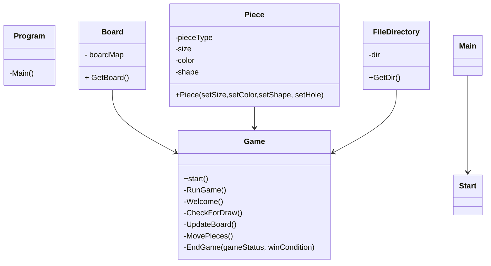

# Jogo Galo Da Velha

### Autoria

#### Elementos do grupo:
- Hugo Figueira Silva 22001815
- Steven Hall 2200173
  
### Report:

#### Hugo:
- Código:
  - _Game_ Construção do tabuleiro, mais tarde passado a classe _boardMapping_
    - _UI_ (Layout do tabuleiro, menu peças disponiveis, desenho das peças ,legenda, frases de output e cores)
    - Atualização do tabuleiro e movimento das peças
    - Condições de vitoria (Verificar linhas horizontais, verticais e diagonais)
    - Lógica de input e output (Como o jogador poderia escolher as peças e lugar do  tabuleiro desejado)
    - Mensagens de erro
    - Reescrever mensagem inicial (WelcomeText.txt)
  - _Bug fixing_
- Relatório

#### Steven: 
- Código: 
  - Classes  
     - _Piece_ 
     - _Game_ Instanciação de peças, organização, formatão e métodos: _RunGame, Welcome, CheckForDraw_ e _EndGame_.
    - _BoardMapping_ 
    - _FileDirectory_
   
  - Enumeradores
    - _GameStatus_ 
    - _Player_  
    - _PieceHole_
    - _PieceShape_
    - _PieceSize_
    - _PieceColor_ 
  - _Bug fixing_ 
- Relatório

## Arquitetura da solução
### Descrição da solução
- Projeto desenvolvido utilizando a linguagem _C#_ 8.0 e com  [_.NET_](https://learn.microsoft.com/en-us/dotnet/api/?view=netstandard-2.1).

- Projeto consiste no jogo do GaloDaVelha, apresentado visualmente em consola (terminal)

A solução do projeto consiste em jogar o jogo do Galo da Velha na consola, que é um jogo para 2 jogadores (_PvP_). Cada jogador tem o seu turno respectivo, dando a cada um a possibilidade de ganhar ou empatar (caso não haja mais peças disponíveis)

Antes do início do jogo, é apresentado um texto inicial que explica as regras do jogo. Para avançar, o utilizador precisa de pressionar a tecla ENTER, conforme mencionado."

De seguida, surge a primeira visualização do jogo, que apresenta um tabuleiro, o menu das peças disponíveis, uma legenda e o turno do jogador.

O tabuleiro no estado inicial do jogo encontra-se vazio, contendo apenas letras do alfabeto ocupando os espaços de cada dimensão. Essas letras representam a posição de cada espaço disponível no tabuleiro

O menu das peças disponíveis representa, tal como referido, as peças disponíveis. Cada peça tem o seu tamanho, cor, forma e presença de furo. A forma é representada por símbolos _Unicode_, visualmente distinguindo quadrados e círculos. Para representar se as peças têm furo ou não, as formas preenchidas não têm furo, enquanto aquelas com um contorno à volta têm furo. A cor é apresentada pela própria cor de cada peça, podendo ser verdes ou amarelas. O tamanho é indicado pelas letras _'B'_ (grande) e _'S'_ (pequeno), sendo sempre o segundo caractere da forma. Cada peça é identificada por um número entre parênteses retos. Este número serve como referência ao jogador para selecionar a peça desejada ao introduzir o número correspondente.

Em seguida, encontra-se uma legenda que explica o significado das letras que seguem a forma, como mencionado anteriormente. A letra _'B'_ (maiúscula) indica que a peça é grande, enquanto a letra _'s'_ (minúscula) indica que a peça é pequena. Caso o jogador deseje sair do programa quando for solicitado qualquer input, basta escrever 'ESC' para encerrar o projeto.

Em cada turno, é indicado qual jogador está a vez de jogar. Após esta informação, é apresentada a primeira instrução: _'Escreva a letra onde deseja colocar a peça:'_. Aqui, o jogador deve inserir uma das letras representadas no tabuleiro, indicando em que espaço deseja colocar a peça escolhida. Se o jogador inserir mais do que uma letra ou uma letra que não exista no tabuleiro, será exibida uma mensagem de erro, mas o jogador não perderá o turno. Em seguida, é perguntado: _'Qual é o número da peça que deseja:'_. Aqui, o jogador deve selecionar o número correspondente à peça desejada. Se inserir um número inválido ou um número maior ou menor do que os números disponíveis para as peças, será exibida uma mensagem de erro, sem que o jogador perca o turno.

Após o término do turno, as mesmas informações são mostradas novamente (tabuleiro, peças, legenda, instruções, etc.), porém, estas estarão atualizadas de acordo com o turno anterior. As letras do tabuleiro serão substituídas pelas peças selecionadas, e as peças disponíveis irão diminuir conforme forem selecionadas. Este ciclo se repetirá até que um dos jogadores vença ou ocorra um empate.

Se um dos jogadores ganhar, seja na horizontal, vertical ou diagonal, uma mensagem indicando qual jogador venceu e como será exibida, por exemplo: _'O jogador 2 ganhou na horizontal!'_. Em caso de empate, uma mensagem referindo que ocorreu um empate será exibida. Após esta mensagem de vitória ou empate, será exibida pela última vez a atualização final do tabuleiro com as peças nos seus lugares correspondentes, bem como a última atualização do menu das peças disponíveis.

Por fim, a última mensagem do programa (_'Utilize o comando: dotnet run --project ProjectGaloDaVelha para jogar novamente!'_) indica que os jogadores podem usar este comando para jogar novamente.

  
Portanto concluímos assim que as funções só fazem a uma função que lhes foi dada e não varias coisas diferentes.

### Diagrama _UML_

## Referências 

### IAs generativas
  O uso de IAs generativas foi usado e neste tópico explicaremos como: 
- O _Chat Bing_ (_Chat GPT-4_) foi utilizado para tirar dúvidas e explicar itens da [documentação](https://learn.microsoft.com/en-us/dotnet/api/?view=netstandard-2.1) de forma mais clara e simples, erros, exemplos e também para obter de forma mais rápida _links_ com código útil com foi o caso particular do tópico [Remover linhas do ficheiro](https://stacktuts.com/how-to-delete-a-line-from-a-text-file-in-c).   
  Sem mencionar que um é um erro comum quando o nome de ficheiro não é válido ao utilzarmos o [_stream reader_](https://learn.microsoft.com/en-us/dotnet/api/system.io.streamreader?view=netstandard-2.1) onde pelo menos podemos dizer que foi a nossa experiência ao utilizar esta classe do [_C#_](https://learn.microsoft.com/en-us/dotnet/csharp/).

  
- Nenhum código fornecido por IAs generativas foi diretamente utilizado para a realização desse projeto como explicado acima, apenas a título de curiosidade, pesquisa, exemplos e explicação de tópicos da documentação.

### Consultas com docentes
  
  A Realização deste projeto consistiu essencialmente em pesquisa própria, conhecimento adquirido por trabalhos e ensino fornecido por proferessores em diversas unidades curriculares lecionadas na [licenciatura de Videojogos](https://www.ulusofona.pt/lisboa/licenciaturas/videojogos).
#

### Links de pesquisa utilizados para realização do projeto
* [_Getters & Setters_](https://www.w3schools.com/cs/cs_properties.php)
* [_Console.Clear()_]()
* [_C# Arrays W3 Schools_](https://www.w3schools.com/cs/cs_arrays.php)
* [_Tic Tac toe_ linhas, colunas e diagonal](https://www.c-sharpcorner.com/UploadFile/75a48f/tic-tac-toe-game-in-C-Sharp/)

* [Unicode Symbols](https://symbl.cc/en/unicode-table/)
* [Digrama UML Mermaid](https://mermaid.js.org/syntax/classDiagram.html)
#### API
* [_Arrays & Multidimensional Arrays_](https://learn.microsoft.com/en-us/dotnet/csharp/language-reference/builtin-types/arrays)
* [_Stream Reader & Error Handling_](https://learn.microsoft.com/en-us/dotnet/api/system.io.streamreader?view=netstandard-2.1)
* [ List ](https://learn.microsoft.com/en-us/dotnet/api/system.collections.generic.list-1?view=netstandard-2.1)
* [PadRight(Int32)](https://learn.microsoft.com/en-us/dotnet/api/system.string.padright?view=netstandard-2.1)
* [ANSI Color codes](https://www.lihaoyi.com/post/BuildyourownCommandLinewithANSIescapecodes.html)
* [Envrionment.Exit(Int32)](https://learn.microsoft.com/en-us/dotnet/api/system.environment.exit?view=netstandard-2.1)
#### _Youtube_
* [Planeamente Geral de classes, enumeradores](https://www.youtube.com/watch?v=NUNlVjt82m8&t=738s)
* [FUTURO VER BOARD CLASS](https://www.youtube.com/watch?v=Z1Zi41eiNGs&t=80s)
* [_Stream Reader_ exemplo](https://www.youtube.com/watch?v=tApBDuVwCrc)

