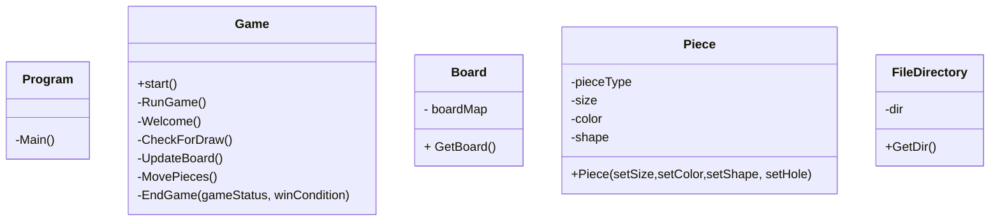

# Jogo Galo Da Velha

### Autoria

#### Elementos do grupo:
- Hugo Figueira Silva 22001815
- Steven Hall 2200173
  
### Report:

#### Hugo:
- Código:
  - _Game_ Construção do tabuleiro, mais tarde passado a classe _boardMapping_
    - _UI_ (Layout do tabuleiro, menu peças disponiveis, desenho das peças ,legenda, frases de output e cores)
    - Atualização do tabuleiro e movimento das peças
    - Condições de vitoria (Verificar linhas horizontais, verticais e diagonais)
    - Lógica de input e output (Como o jogador poderia escolher as peças e lugar do  tabuleiro desejado)
    - Mensagens de erro
    - Reescrever mensagem inicial (WelcomeText.txt)
  - _Bug fixing_
- Relatório

#### Steven: 
- Código: 
  - Classes  
     - _Piece_ 
     - _Game_ Instanciação de peças, organização, formatão e métodos: _RunGame, Welcome, CheckForDraw_ e _EndGame_.
    - _BoardMapping_ 
    - _FileDirectory_
   
  - Enumeradores
    - _GameStatus_ 
    - _Player_  
    - _PieceHole_
    - _PieceShape_
    - _PieceSize_
    - _PieceColor_ 
  - _Bug fixing_ 
- Relatório

## Arquitetura da solução
### Descrição da solução
- Projeto desenvolvido utilizando a linguagem _C#_ 8.0 e com  [_.NET_](https://learn.microsoft.com/en-us/dotnet/api/?view=netstandard-2.1).

- Projeto consiste no jogo do GaloDaVelha, apresentado visualmente em consola (terminal)

A solução do projeto consiste em jogar o jogo do Galo da Velha na consola, que é um jogo para 2 jogadores (_PvP_). Cada jogador tem o seu turno respectivo, dando a cada um a possibilidade de ganhar ou empatar (caso não haja mais peças disponíveis)

Antes do jogo começar, o utilizador é apresentado com as regras. Para avançar, pressiona ENTER.
A primeira visualização mostra o tabuleiro, peças disponíveis, legenda e turno do jogador.
O tabuleiro inicial está vazio, com letras representando os espaços.

O menu das peças mostra tamanho, cor, forma e presença de furo. A forma é representada por símbolos Unicode, distinguindo quadrados e círculos. 'B' significa grande e 's' significa pequeno. Cada peça é numerada.
Uma legenda explica os símbolos.

Se desejar sair, o jogador escreve 'ESC'.
Em cada turno, o jogador escolhe onde colocar a peça e seu número.
Após o turno, o tabuleiro e peças são atualizados.
O jogo continua até um jogador ganhar ou haver empate.
Mensagens indicam a vitória do jogador ou empate.
O programa sugere o comando para jogar novamente.

  
Portanto concluímos assim que as funções só fazem a uma função que lhes foi dada e não varias coisas diferentes.

CODIGO ALGORITMO

### Diagrama _UML_

## Referências 

### IAs generativas
  O uso de IAs generativas foi usado e neste tópico explicaremos como: 
- O _Chat Bing_ (_Chat GPT-4_) foi utilizado para tirar dúvidas e explicar itens da [documentação](https://learn.microsoft.com/en-us/dotnet/api/?view=netstandard-2.1) de forma mais clara e simples, erros, exemplos e também para obter de forma mais rápida _links_ com código útil com foi o caso particular do tópico [Remover linhas do ficheiro](https://stacktuts.com/how-to-delete-a-line-from-a-text-file-in-c).   
  Sem mencionar que um é um erro comum quando o nome de ficheiro não é válido ao utilzarmos o [_stream reader_](https://learn.microsoft.com/en-us/dotnet/api/system.io.streamreader?view=netstandard-2.1) onde pelo menos podemos dizer que foi a nossa experiência ao utilizar esta classe do [_C#_](https://learn.microsoft.com/en-us/dotnet/csharp/).

  
- Nenhum código fornecido por IAs generativas foi diretamente utilizado para a realização desse projeto como explicado acima, apenas a título de curiosidade, pesquisa, exemplos e explicação de tópicos da documentação.

### Consultas com docentes
  
  A Realização deste projeto consistiu essencialmente em pesquisa própria, conhecimento adquirido por trabalhos e ensino fornecido por proferessores em diversas unidades curriculares lecionadas na [licenciatura de Videojogos](https://www.ulusofona.pt/lisboa/licenciaturas/videojogos).
#

### Links de pesquisa utilizados para realização do projeto
* [_Getters & Setters_](https://www.w3schools.com/cs/cs_properties.php)
* [_Console.Clear()_]()
* [_C# Arrays W3 Schools_](https://www.w3schools.com/cs/cs_arrays.php)
* [_Tic Tac toe_ linhas, colunas e diagonal](https://www.c-sharpcorner.com/UploadFile/75a48f/tic-tac-toe-game-in-C-Sharp/)

* [Unicode Symbols](https://symbl.cc/en/unicode-table/)
* [Digrama UML Mermaid](https://mermaid.js.org/syntax/classDiagram.html)
#### API
* [_Arrays & Multidimensional Arrays_](https://learn.microsoft.com/en-us/dotnet/csharp/language-reference/builtin-types/arrays)
* [_Stream Reader & Error Handling_](https://learn.microsoft.com/en-us/dotnet/api/system.io.streamreader?view=netstandard-2.1)
* [_List_ ](https://learn.microsoft.com/en-us/dotnet/api/system.collections.generic.list-1?view=netstandard-2.1)
* [_List .Select_](https://learn.microsoft.com/en-us/dotnet/api/system.linq.enumerable.select?view=netstandard-2.1)
* [_PadRight(Int32)_](https://learn.microsoft.com/en-us/dotnet/api/system.string.padright?view=netstandard-2.1)
* [_ANSI Color codes_](https://www.lihaoyi.com/post/BuildyourownCommandLinewithANSIescapecodes.html)
* [_Envrionment.Exit(Int32)_](https://learn.microsoft.com/en-us/dotnet/api/system.environment.exit?view=netstandard-2.1)
#### _Youtube_
* [Planeamente Geral de classes, enumeradores](https://www.youtube.com/watch?v=NUNlVjt82m8&t=738s)
* [FUTURO VER BOARD CLASS](https://www.youtube.com/watch?v=Z1Zi41eiNGs&t=80s)
* [_Stream Reader_ exemplo](https://www.youtube.com/watch?v=tApBDuVwCrc)

