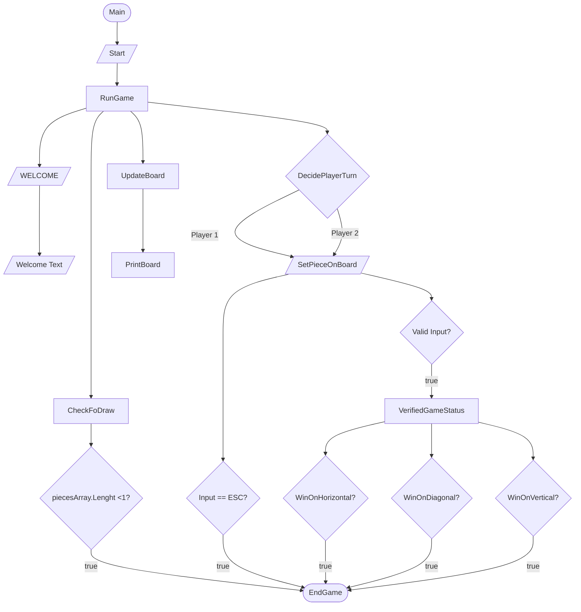

# Jogo Galo Da Velha

### Autoria

#### Elementos do grupo:
- Hugo Figueira Silva  22001815
- Steven Hall 2200173
  
### _Report_:

#### Hugo:
- Código:
  - _Game_ Construção do tabuleiro, mais tarde passado a classe _boardMapping_
    - _UI_ (Layout do tabuleiro, menu peças disponiveis, desenho das peças ,legenda, frases de output e cores)
    - Atualização do tabuleiro e movimento das peças
    - Condições de vitoria (Verificar linhas horizontais, verticais e diagonais)
    - Lógica de input e output (Como o jogador poderia escolher as peças e lugar do  tabuleiro desejado)
    - Mensagens de erro
    - Reescrever e formatar mensagem inicial (WelcomeText.txt)
  - _Bug fixing_
- Relatório: 40.0%
- UML: 50.0%

#### Steven: 
- Código: 
  - Classes  
    - _Piece_ 
    - _Game_ Instanciação de peças, organização, formatão e métodos: _RunGame, Welcome, CheckForDraw_ e _EndGame_.
    - _Board_ 
    - _FileDirectory_
   
  - Enumeradores
    - _GameStatus_ 
    - _Player_  
    - _PieceHole_
    - _PieceShape_
    - _PieceSize_
    - _PieceColor_ 
  - _Bug fixing_ 
- Relatório: 60.0%
- UML: 50.0%

## Arquitetura da solução
### Descrição da solução
- Projeto desenvolvido utilizando a linguagem _C#_ 8.0 e [_.NET_](https://learn.microsoft.com/en-us/dotnet/api/?view=netstandard-2.1).

- Projeto consiste no jogo do GaloDaVelha, apresentado visualmente em consola (terminal)

A solução do projeto consiste em jogar o jogo do Galo da Velha na consola, que é um jogo para 2 jogadores (_PvP_). Cada jogador tem o seu turno respectivo, dando a cada um a possibilidade de ganhar ou empatar (caso não haja mais peças disponíveis)

Antes do jogo começar, o utilizador é apresentado com as regras. Para avançar, pressiona ENTER.
A primeira visualização mostra o tabuleiro, peças disponíveis, legenda e turno do jogador.
O tabuleiro inicial está vazio, com letras representando os espaços.

O menu das peças mostra tamanho, cor, forma e presença de furo. A forma é representada por símbolos Unicode, distinguindo quadrados e círculos. 'B' significa grande e 's' significa pequeno. Cada peça é numerada.
Uma legenda explica os símbolos.

Se desejar sair, o jogador escreve 'ESC'.
Em cada turno, o jogador escolhe onde colocar a peça e seu número.
Após o turno, o tabuleiro e peças são atualizados.
O jogo continua até um jogador ganhar ou haver empate.
Mensagens indicam a vitória do jogador ou empate.
O programa sugere o comando para jogar novamente.

Arquitetura deste projeto consiste em criar uma instância de um jogo a partir da classe _Program_, sendo esta a classe _Game_. Grande maioria do código e lógica está contida dentro dessa mesma classe, mas utiliza código externo como enumeradores e classes para a lógica de jogo poder funcionar bem e respeitar o princípio _Single Responsability_.

Classes utilizadas (instânciadas) por _Game_ são _Piece_ _Board_ e _FileDirectory_ onde, respectivamente: 
- _Piece_: Peças são inicializadas dentro de um _array_ da classe _Game_ fazendo uso do construtor que posteriormente utiliza os _setters_ privados para configurar cada peça. 
Há um total de 16 instâncias ou peças. 
- _Board_: Instância é criada para poder haver acesso ao layout do tabuleiro. _Layout_ do tabuleiro é obtido através de um _getter_ público.
- _FileDirectory_: Dentro do método _Welcome_, é feito uma instância local da classe _FileDirectory_. Assim, é possível utilizar o _getter_ que devolve um diretório (especificamente qual diretório, depende de como o código é corrido). Utilizando o comando normal(ensinado em aula: dontet run --project ProjectName) um texto de boas-vindas é apresentado ao utilizador.

Enumeradores utilizados pela classe _Game_: Estes Enumerados são utilizados para gerir a lógica de _gameplay_ como definir o estado  de jogo e definir qual jogador é o turno.

- GameStatus: Contém os estados em que o jogo pode se encontrar sendo:
  - _draw_ = Empate por falta de peças
  - _player1Win_ = Vitória do jogador 1
  - _player2Win_  = Vitória do jogador 2
  - _exit_ = Algum dos jogadores decidiu sair do jogo
- _Player_: Contém o estado de jogador, podendo ser jogador 1 ou 2. É utilizado para mostrar o turno e apresentar de qual jogador é a vitória.
  - _player1_ 
  - _player2_

Enumeradores utilizados pela classe _Piece_: Estes enumeradores são utilizados para definir limites e as características de cada peça como cor, se tem furo ou não, formato e finalmente tamanho
- _PieceColor_: 
- _PieceHole_:
- _PieceShape_:
- _PieceSize_: 

O tabuleiro é construído visualmente usando caracteres como '+' ou '-', com esses caracteres organizados em ciclos for. Em cada espaço vazio do tabuleiro, é feito um print de cada elemento do array de letras. Mais tarde, esses espaços podem ser substituídos pelas peças que o jogador escolher. Após receber os inputs do jogador, e em caso de não haver erro, o método VerifiedGameStatus é executado. Este método verifica se existe uma sequência de cores, tamanhos, formas ou furos na vertical, horizontal e diagonal. Para essa verificação, cada par de elementos do array 'piecesVerified' é percorrido. Se os elementos não forem vazios, é verificada a existência de uma sequência. Se uma sequência for encontrada e a variável 'mensagemExibida' for false, ela é alterada para true para evitar a repetição da mensagem de vitória. Então, o jogador vencedor e como ele venceu são exibidos.

### Fluxograma

## Referências 

### IAs generativas
  O uso de IAs generativas foi usado e neste tópico explicaremos como: 
- Utilizamos o _Chat Bing_ que utiliza o (_Chat GPT-4_) foi utilizado para tirar dúvidas e explicar itens da [_API_](https://learn.microsoft.com/en-us/dotnet/api/?view=netstandard-2.1) de forma mais clara e para erros simples. Como também para ter exemplos e obter de forma mais rápida _links_ com código útil como foi o caso de [_Envrionment.Exit(Int32)_](https://learn.microsoft.com/en-us/dotnet/api/system.environment.exit?view=netstandard-2.1) e  [_List .Select_](https://learn.microsoft.com/en-us/dotnet/api/system.linq.enumerable.select?view=netstandard-2.1). 

- O único 100% proveniente de IAs generativas, foi o código da tabela, ou seja, o código contido dentro do método _UpdateBoard_, dentro da classe _Game_ (Game.cs) que desenha a tabela com carecteres "+" e "-".

- A IA generativa também auxiliou nas boas práticas e convenções _C#_, informando que seria má prática inicializar variáveis isoladas da classe Piece, sendo melhor utilizar um _array_ ou _List_ onde, optamos por inicializar as _Pieces_ num _array_ na classe _Game_. Finalmente, relativamente a documentação (_XML_) informou que se pode fazer documentação em enumeradores e então procedemos a fazer.
   

### Consultas com docentes
  
A Realização deste projeto consistiu essencialmente em pesquisa própria, conhecimento adquirido por trabalhos e ensino fornecido por proferessores em diversas unidades curriculares lecionadas na [licenciatura de Videojogos](https://www.ulusofona.pt/lisboa/licenciaturas/videojogos).

O único docente com quem foi entrado em contacto para discutir questões relacionadas ao projeto, dúvidas, lógica e/ou eficiência do código foi ao professor Nuno Fachada.
#

### _Links_ de pesquisa utilizados para realização do projeto
* [_Getters & Setters_](https://www.w3schools.com/cs/cs_properties.php)
* [_C# Arrays W3 Schools_](https://www.w3schools.com/cs/cs_arrays.php)
* [_Tic Tac toe_ linhas, colunas e diagonal](https://www.c-sharpcorner.com/UploadFile/75a48f/tic-tac-toe-game-in-C-Sharp/)

* [Unicode Symbols](https://symbl.cc/en/unicode-table/)
* [Digrama UML Mermaid](https://mermaid.js.org/syntax/classDiagram.html)
* [_Mermaid Flowchart_](https://mermaid.js.org/syntax/flowchart.html)

#### _API_
* [_Arrays & Multidimensional Arrays_](https://learn.microsoft.com/en-us/dotnet/csharp/language-reference/builtin-types/arrays)
* [_Stream Reader & Error Handling_](https://learn.microsoft.com/en-us/dotnet/api/system.io.streamreader?view=netstandard-2.1)
* [_List_ ](https://learn.microsoft.com/en-us/dotnet/api/system.collections.generic.list-1?view=netstandard-2.1)
* [_List .Select_](https://learn.microsoft.com/en-us/dotnet/api/system.linq.enumerable.select?view=netstandard-2.1)
* [_PadRight(Int32)_](https://learn.microsoft.com/en-us/dotnet/api/system.string.padright?view=netstandard-2.1)
* [_ANSI Color codes_](https://www.lihaoyi.com/post/BuildyourownCommandLinewithANSIescapecodes.html)
* [_Envrionment.Exit(Int32)_](https://learn.microsoft.com/en-us/dotnet/api/system.environment.exit?view=netstandard-2.1)
*  [_Console.Clear()_](https://learn.microsoft.com/en-us/dotnet/api/system.console.clear?view=netstandard-2.1)

#### _Youtube_
* [Planeamente Geral de classes, enumeradores](https://www.youtube.com/watch?v=NUNlVjt82m8&t=738s)
* [_Board class_](https://www.youtube.com/watch?v=Z1Zi41eiNGs&t=80s)
* [_Stream Reader_ exemplo](https://www.youtube.com/watch?v=tApBDuVwCrc)
---

