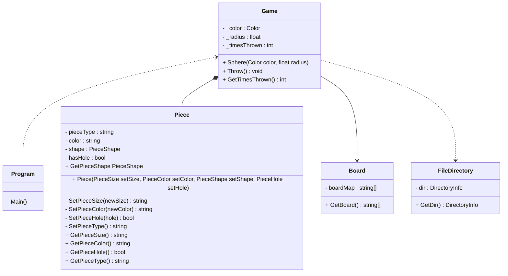

# UML DIAGRAM CLASSES

```mermaid

classDiagram


    Game    <.. Program 
    Game    *--  Piece
    Game    --> Board
    Game    ..> FileDirectory

    class Program{
       - Main()
     
    }
    class Piece{
        - pieceType : string
        - color : string
        - shape : PieceShape 
        - hasHole : bool
        + Piece(PieceSize setSize, PieceColor setColor, PieceShape setShape, PieceHole setHole)

        - SetPieceSize (newSize)  string
        - SetPieceColor (newColor) string
        - SetPieceHole (hole) bool
        - SetPieceType() string

        + GetPieceSize() string
        + GetPieceColor() string 
        + GetPieceShape PieceShape
        + GetPieceHole() bool
        + GetPieceType() string
    }

    
    class Board{
        - boardMap : string[]
        + GetBoard() string[]
        

    }
    class Game{
        - _color : Color
        - _radius : float
        - _timesThrown : int
        + Sphere(Color color, float radius)
        + Throw() void
        + GetTimesThrown() int
    }

    class FileDirectory{
        - dir : DirectoryInfo 
        + GetDir() DirectoryInfo
    }
    

```
#