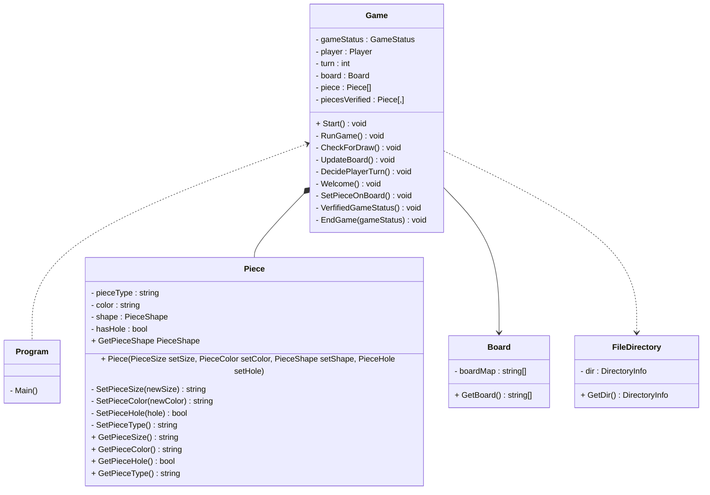

# UML DIAGRAM CLASSES

```mermaid

classDiagram


    Game    <.. Program 
    Game    *--  Piece
    Game    --> Board
    Game    ..> FileDirectory

    class Program{
       - Main()
     
    }
    class Piece{
        - pieceType : string
        - color : string
        - shape : PieceShape 
        - hasHole : bool
        + Piece(PieceSize setSize, PieceColor setColor, PieceShape setShape, PieceHole setHole)

        - SetPieceSize (newSize)  string
        - SetPieceColor (newColor) string
        - SetPieceHole (hole) bool
        - SetPieceType() string

        + GetPieceSize() string
        + GetPieceColor() string 
        + GetPieceShape PieceShape
        + GetPieceHole() bool
        + GetPieceType() string
    }

    
    class Board{
        - boardMap : string[]
        + GetBoard() string[]
        

    }
    class Game{
        - gameStatus            : GameStatus
        - player                : Player
        - turn                  : int
        - board                 : Board
        - piece                 : Piece[]
        - piecesVerified        : Piece[,]

        + Start()               void
        - RunGame()             void
        - CheckForDraw()        void
        - UpdateBoard()         void
        - DecidePlayerTurn()    void
        - Welcome()             void
        - SetPieceOnBoard()     void
        - VerfifiedGameStatus() void
        - EndGame(gameStatus)   void

    }

    class FileDirectory{
        - dir : DirectoryInfo 
        + GetDir() DirectoryInfo
    }
    

```
#